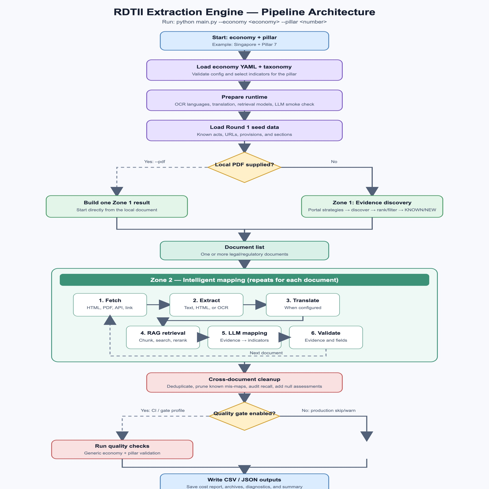
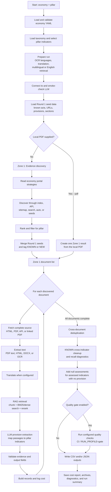

# RDTII pipeline architecture

Run with:

```bash
python main.py --economy Singapore --pillar 7
```

The economy YAML controls portal access, discovery, fetching, OCR, language,
translation, and model choices. The pillar selects the indicators from
`taxonomy.json`.





## What each part does

| Part | Main code | Role |
|---|---|---|
| Startup | `main.py` | Loads configuration, taxonomy, seeds, models, and runtime settings. |
| Zone 1 | `src/crawler/` | Finds relevant legal and regulatory documents for the economy and pillar. |
| Fetch and OCR | `src/fetcher/`, `src/ocr/` | Gets complete documents and converts them to usable text. |
| Retrieval | `src/retrieval/` | Finds the passages most relevant to each pillar indicator. |
| Mapping | `src/mapping/` | Uses the LLM to extract and map evidence to indicators. |
| Validation | `src/output/validator.py` | Checks evidence, anchors, fields, and review flags. |
| Output | `src/output/` | Writes CSV/JSON and records costs, archives, and diagnostics. |

## Important branches

- The optional quality gate is generic and can be enabled for CI/build
  validation; production can skip it or run it in warning-only mode.
- `--pdf` skips live discovery and starts Zone 2 with one local document.
- A failed discovery falls back to known Round 1 seed URLs when available.
- English-only economies use English retrieval models; other economies use
  multilingual retrieval over the original text.
- `TBD` portal strategies are skipped until configured.
